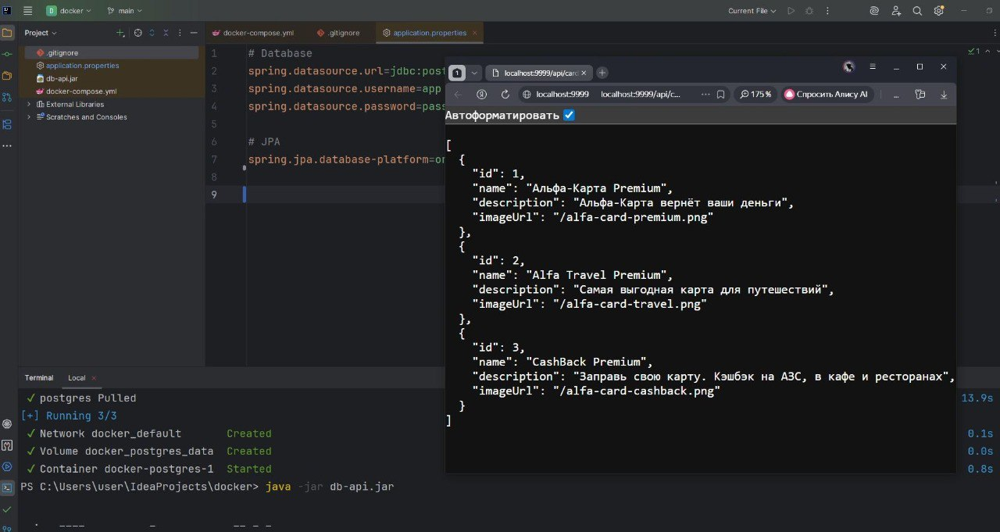

# Banking Cards Mock Service (Docker & Spring Boot API)

Учебный проект для отработки навыков контейнеризации приложения и базы данных с помощью **Docker**, **Docker Compose** и взаимодействия Spring Boot приложения с СУБД **PostgreSQL**.

## 📌 Описание проекта

Проект представляет собой REST API сервис карт и банковских продуктов (Альфа-Карта Premium, Alfa Travel Premium, CashBack Premium и др.).  
Сервис поднимает базу данных PostgreSQL в Docker-контейнере, к которой подключается исполняемый файл приложения (`db-api.jar`).

### Архитектура и стек технологий:
* **Java 11+ / Spring Boot** (`db-api.jar`)
* **PostgreSQL 15** (Alpine)
* **Docker & Docker Compose**
* **Spring Data JPA / Hibernate**
* **REST API** (порт по умолчанию: `9999`)

---

## 📁 Структура проекта

```
.
├── application.properties # Конфигурация подключения приложения к БД
├── db-api.jar              # Собранное Spring Boot приложение
├── docker-compose.yml     # Конфигурация разворачивания PostgreSQL в Docker
├── img.png                # Скриншот работы приложения
└── README.md              # Документация проекта
```

---

## 🚀 Быстрый запуск

### 1. Требования

Перед запуском убедитесь, что у вас установлены:
* Docker Desktop (включая Docker Compose)
* Java Runtime Environment (JRE / JDK 11 или выше)

### 2. Запуск базы данных в Docker

Разверните СУБД PostgreSQL в контейнере с помощью Docker Compose:

```bash
docker-compose up -d
```

Команда запустит сервис `postgres` на порту `5432` со следующими параметрами:
* **Host:** `localhost:5432`
* **Database:** `db`
* **User:** `app`
* **Password:** `pass`

Для проверки статуса контейнера:

```bash
docker-compose ps
```

### 3. Запуск Spring Boot приложения

Запустите JAR-файл приложения из корневой директории проекта:

```bash
java -jar db-api.jar
```

Приложение автоматически применит настройки из `application.properties`, подключится к PostgreSQL и запустит HTTP-сервер на порту `9999`.

---

## 🧪 Проверка работы (API Endpoints)

После успешного запуска приложение станет доступно по адресу: `http://localhost:9999`

### Получение списка банковских карт

**Запрос:**

```http
GET http://localhost:9999/api/cards
```

**Пример ответа (JSON):**

```json
[
  {
    "id": 1,
    "name": "Альфа-Карта Premium",
    "description": "Альфа-Карта вернёт ваши деньги",
    "imageUrl": "/alfa-card-premium.png"
  },
  {
    "id": 2,
    "name": "Alfa Travel Premium",
    "description": "Самая выгодная карта для путешествий",
    "imageUrl": "/alfa-card-travel.png"
  },
  {
    "id": 3,
    "name": "CashBack Premium",
    "description": "Заправь свою карту. Кэшбэк на АЗС, в кафе и ресторанах",
    "imageUrl": "/alfa-card-cashback.png"
  }
]
```

---

## 🛠 Полезные команды

Остановка контейнера с базой данных:

```bash
docker-compose down
```

Остановка с удалением сохранённых данных (Volume):

```bash
docker-compose down -v
```

Просмотр логов базы данных:

```bash
docker-compose logs -f postgres
```



